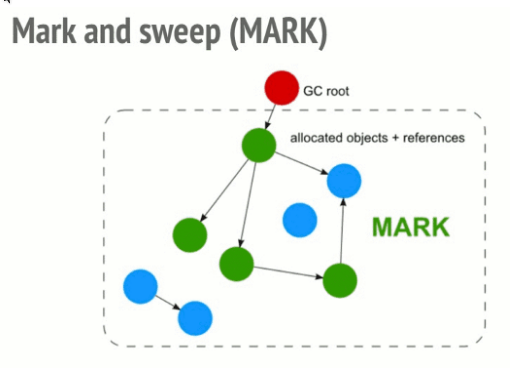

# Estrategias

## **Mark-and-sweep (Marcado y barrido)**

Este algoritmo reduce la definición de "un objeto ya no es necesitado" a "un objeto es inalcanzable"

Este algoritmo asume la noción de un grupo de objetos llamados objetos raíz (en _JavaScript_ la raíz es el objeto global). Periódicamente el recolector empieza por estas raíces, encuentra todos los objetos que están referenciados por estas raíces, y luego todos los objetos referenciados de estos, etc. Empezando por las raíces, el recolector de esta forma encontrará todos los objetos que son alcanzables y recolectará los objetos inalcanzables.

Este algoritmo es mejor que el anterior ya que "un objeto tiene cero referencias" equivale al "objeto es inalcanzable". Esto no sucedía asi en el algoritmo anterior cuando se trataba de un ciclo.

Desde el 2012, todos los navegadores incluyen un recolector de basura basado en mark-and-sweep. Todas las mejoras realizadas en el campo de Recolección de basura en _JavaScript_ (recolección generacional/incremental/concurrida/paralela) en los ultimos años son mejoras a la implementación del algoritmo, pero no mejoras sobre el algoritmo de recolección ni a la reducción de la definicion de cuando "un objeto ya no es necesario".

La siguiente visualización muestra el proceso:

``1.``


``2.``


``3.``


``4.``


``5.``


``6.``


### **Reference Counting (Conteo de referencias)**

__Reference counting__ lo que hace es contar el número de veces que un objeto es referenciado por otro objeto en el sistema. Cuando la referencias a un objeto son removidas, el __reference count__ de ese objeto es decrementado. Cuando el reference count llega a 0, el objeto es liberado(deallocated).

Por ejemplo, supongamos que tenemos 2 o más variables que tienen el mismo valor, entonces, lo que la máquina virtual de _Python_ hace es, en vez de crear otro objeto del mismo valor en el **heap** privado, en realidad hace que la segunda variable apunte al valor que originalmente existía en el **heap** privado. Por lo tanto, en el caso de clases, tener un número de referencias puede ocupar una gran cantidad de espacio en memoria, en dicho caso referencing counting es altamente beneficioso para preservar la memoria disponible para otros objetos.

#### Ventajas y desventajas 

La principal ventaja del recuento de referencias sobre el seguimiento de la recolección de basura es que los objetos se reclaman tan pronto como ya no se pueden hacer referencia a ellos, y de manera incremental, sin pausas largas para los ciclos de recolección y con una vida útil claramente definida de cada objeto. En aplicaciones o sistemas en tiempo real con memoria limitada, esto es importante para mantener la capacidad de respuesta. El recuento de referencias también se encuentra entre las formas más sencillas de implementar la gestión de la memoria. También permite una gestión eficaz de los recursos que no son de memoria, como los objetos del sistema operativo, que a menudo son mucho más escasos que la memoria (los sistemas de recolección de basura de rastreo usan finalizadores para esto, pero la recuperación retrasada puede causar problemas). Los recuentos de referencia ponderados son una buena solución para la recolección de basura en un sistema distribuido.

Los recuentos de referencias también son información útil para usar como entrada para otras optimizaciones de tiempo de ejecución. Por ejemplo, los sistemas que dependen en gran medida de objetos inmutables, como muchos lenguajes de programación funcional, pueden sufrir una penalización de eficiencia debido a las copias frecuentes. [Cita requerida] Sin embargo, si el compilador (o el sistema de tiempo de ejecución) sabe que un objeto en particular tiene solo una referencia ( como hace la mayoría en muchos sistemas), y que la referencia se pierde al mismo tiempo que se crea un nuevo objeto similar (como en la sentencia de adición de cadena ```str ← str + "a"```), puede reemplazar la operación con una mutación en el objeto original.

El recuento de referencia tiene dos desventajas  fundamentales sobre la recoleccion de basura restreo, las cuales requieren mecanismos adicionales para mejorarlas. 

  - Las frecuentes actualizaciones que implica son una fuente de ineficiencia. Si bien el seguimiento de los recolectores de basura puede afectar gravemente la eficiencia a través del cambio de contexto y las fallas de la línea de caché, se recolectan con relativa poca frecuencia, mientras que el acceso a los objetos se realiza de forma continua. Además, lo que es menos importante, el recuento de referencias requiere que cada objeto gestionado por memoria reserve espacio para un recuento de referencias. Al rastrear recolectores de basura, esta información se almacena implícitamente en las referencias que hacen referencia a ese objeto, ahorrando espacio, aunque rastrear recolectores de basura, particularmente los incrementales, puede requerir espacio adicional para otros propósitos.
 
  - El algoritmo ingenuo descrito anteriormente no puede manejar ciclos de referencia, un objeto que se refiere directa o indirectamente a sí mismo. Un mecanismo que se base exclusivamente en recuentos de referencias nunca considerará cadenas cíclicas de objetos para su eliminación, ya que se garantiza que su recuento de referencias no será cero. Existen métodos para abordar este problema, pero también pueden aumentar la sobrecarga y la complejidad del recuento de referencias; por otro lado, estos métodos solo deben aplicarse a datos que pueden formar ciclos, a menudo un pequeño subconjunto de todos los datos. Uno de esos métodos es el uso de referencias débiles, mientras que otro implica el uso de un algoritmo de barrido de marcas que se llama con poca frecuencia para limpiar.

El recuento de referencias por sí solo no puede mover objetos para mejorar el rendimiento de la caché, por lo que los recolectores de alto rendimiento también implementan un recolector de basura de seguimiento. La mayoría de las implementaciones (como las de PHP y Objective-C) tienen un rendimiento de caché deficiente, ya que no implementan la copia de objetos.

#### Ejemplos de uso 

 - **C++** no realiza el recuento de referencias de forma predeterminada, cumpliendo con su filosofía de no agregar funcionalidad que pueda incurrir en gastos generales donde el usuario no lo ha solicitado explícitamente. Se puede acceder a los objetos que se comparten pero que no son de propiedad a través de una referencia, un puntero sin formato o un iterador (una generalización conceptual de punteros). 
 
 - **Delphi** En su mayoría, Delphi no es un lenguaje de recolección de basura, en el sentido de que los tipos definidos por el usuario aún deben asignarse y desasignarse manualmente, sin embargo, proporciona una recopilación automática mediante el recuento de referencias para algunos tipos integrados, como cadenas, matrices dinámicas e interfaces, para facilitar su uso y simplificar la funcionalidad de la base de datos genérica. Depende del programador decidir si utilizar los tipos integrados; Los programadores de Delphi tienen acceso completo a la gestión de memoria de bajo nivel como en C / C ++. Por lo tanto, todo el costo potencial del recuento de referencias de Delphi puede, si se desea, eludir fácilmente.
 - **Perl** también usa el conteo de referencias, sin ningún manejo especial de referencias circulares, aunque (como en Cocoa y C ++ arriba), Perl admite referencias débiles, lo que permite a los programadores evitar la creación de un ciclo.
 - **PHP** utiliza un mecanismo de recuento de referencias para su gestión de variables internas. Desde PHP 5.3, implementa el algoritmo del artículo de Bacon mencionado anteriormente. PHP le permite activar y desactivar la colección de ciclos con funciones a nivel de usuario. También le permite forzar manualmente la ejecución del mecanismo de purging.
 - **Python** también utiliza el recuento de referencias y también ofrece detección de ciclos (y puede recuperarlos) 

## Traicing garbage collection

Traicing garbage collection es una forma de manejo de memoria automática que consiste en determinar que objetos deben ser liberados. Rastreando que objetos son alcanzables por una cadena de referencias de ciertas objetos "root", y considerando el resto como "basura" y recolectando estos. Traicing garbage collection es la forma mas común de recolección de basura, tanto es así que "garbage collection" se refiere a "traicing garbage collection", en lugar de a otros métodos como el conteo de referencias, y hay una gran cantidad de algoritmos utilizados en la implementación.

## Accecibilidad de un objeto

Informalmente un objeto es accesible si este es referenciado por al menos una variable en el programa, ya sea directamente o mediante referencias de otros objetos accecibles. Más especificamente, se puede acceder a los objetos solo de dos formas:

- Un distiguido conjunto de roots: objetos que son asumidos son alcanzables. Típicamente, eso include todos los objetos referenciados de cualquier parte en la "Pila de llamadas"(que son todas las variables y parametros locales en la función que se estan invocando actualmente) y culquier variable global.
- cualquiera referencia de un objeto accecible es accesible, mas formalmente, accesibilidad es transitiva.

La definición de accesibilidad de "basura" no es óptima, en la medida en que la última vez que un programa usa un objeto podría ser mucho antes de que ese objeto caiga fuera del alcance del entorno. A veces se hace una distinción entre basura sintáctica (aquellos objetos que el programa posiblemente no pueda alcanzar) y basura semántica (esos objetos que el programa nunca volverá a usar)

El problema de identificar con precisión la basura semántica es parciamente decidible: un programa que asigna un objeto X, ejecuta un programa de entrada arbitrario P termina, requeriria un recolector de basura semántica para resolver resolver el problema de la detección. Aunque los métodos heurísticos conservadores para las detección de basura semántica siguen siendo un area de investigación activa, escencialmente todos los recolectores de basura prácticos se enfocan en la basura sintáctica.

Otra complicación con este enfoque es que, en lenguajes con tipos de referencia y tipos por valor sin caja, el recolector de basura necesita de alguna manera poder distinguir que varaibles en la pila o campos en un objeto son valores regulares y cuales son referencias: en la memoria, un número entero y una referencia pueden parecerse. El recolector de basura necesita saber si tratar el elemento como una referencia y seguirlo, o si es un valor primitivo. Una solución común es el uso de punteros etiquetados.

## Colecciones débiles (Weak collections)

Se pueden diseñar estructuras de datos que tengan características de seguimiento débiles. Por ejemplo las tablas hash débil son útiles. Al igual que la tablas Hash normal, una tabla hash dðbil mantiene una asociación entre un pares de objetos, donde cada clave se entiende como una clave y un valor. Sin embargo la tabla hash no mantiene una referencia sólida sobre estos objetos. Se produce un comportamiento especial cuando la clave, el valor o ambos, se convierten en basura: la entrada de la tablas hash se elimina espontáneamente. Existen mas refinamientos, como tablas hash que solo tienen claves débiles(las referencias de valor son referencias ordinarias, fuertes) o solo valores débiles(las referencias de claves son fuertes)

Las tablas hash débiles son importantes para mantener asociaciones entre objetos, de modo que los objetos involucrados en la asociación aún pueden convertirse en basura si ya nada en el programa se refiere a ellos (aparte de la tabla hash asociada).

El uso de una tabla hash regular para tal propósito podría conducir a una "pérdida de memoria lógica": la acumulación de datos alcanzables que el programa no necesita y no usará.

## Rendimiento (Performance)

El rendimiento de los recolectores de basura de seguimiento, tanto la latencia como el rendimiento, depende significativamente de la implementacion, la carga de trabajo y el entorno. Las impleemntaciones lazy o el uso en entornos con mucha memoria restringida, especialmente los sistemas integrados, pueden resutar en un rendimiento muy deficiente en comparacion con otros métodos, mientras que las implementaciones sofisticadas y el uso en entornos con mucha memoria puede dar como resultado un rendimiento excelente.

En términos de rendimiento el seguimiento, por su naturaleza, requiere una sobrecarga de tiempo de ejecucion implícita, aunque en algunos casos el costo amortizado puede ser extremadamente bajo, en algunos casos incluso menor que una instruccion por asignacion o coleccion, superando la asignacion de pila. La gestion manual de la memoria requiere sobrecarga debido a la liberación explícita de memoria, y el recuento de referencias tiene sobrecarga por incrementar y disminuir los recuentos de referencia y comprobar si el recuento se ha desbordado o ha caido a cero.

En términos de latencia, los recolectores de basura simple de "stop-the-world" pausan la ejecución del programa para la recolección de basura, lo que puede suceder en momentos arbitrarios y tomar un tiempo arbitrario, lo que los hace inutilizable para la computación en tiempo real, especialmente los sistemas integrados, y no se ajustan bien a los sistemas interactivos o cualquier situación en la que la baja latencia sea una prioridad. Sin embrago, los recolectores de basura incrementales pueden proporcionar garantías estrictas en tiempo real y en sistemas con tiempo de inactividad frecuente y suficiente memoria libre, como computadoras personales, la recoleccion de basura se puede programar tiempos de inactividad y tener un impacto mínimo en el rendimiento interactivo. La administración de memoria manual (como en _C++_) y el conteo de referencias tienen un problema similar de pausas arbitrariamente largas en caso de desasignar una estructura de datos grande y todos sus elementos secundarios, aunque esto solo ocurre en momentos fijos, no dependiendo de la recolección de basura.

Algunos avances en la recolección de basura pueden entenderse como reacciones a problemas de rendimiento. Los primeros coleccionistas eran coleccionistas de "stop-the-world", pero el rendimiento de este enfoque distraia la atención de las aplicaciones interactivas. La recolección incremental evito esta interrupcion, pero a costa de una menor eficiencia debido a la necesidad de barreras. Las técnicas de recolección generacional se utilizan con recolectores incrementales y "stop-the-world" para aumentar el rendimiento, la compensación es que parte de la basura no se detecta como tal durante más tiempo de lo normal.
