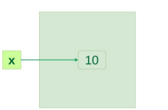
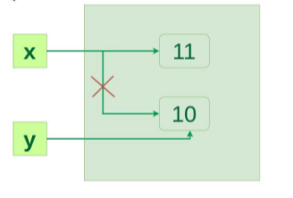

# Enumere brevemente las propuestas más comunes en los lenguajes de programación C#, Python, Java, Go y JavaScript.

## Go

Primero que todo el recolector de basura de _Go_ es un recolector de basura **no generacional**, **concurrente**, **tricolor** de **marca y barrido**.

 _Go_ prefiere asignar memoria en el **stack**, por lo que la mayoría de las asignaciones de memoria terminarán allí. Esto significa que _Go_ tiene una _stack_ por **goroutine** y, cuando sea posible, _Go_ asignará variables a esta _stack_. El compilador de _Go_ intenta probar que no se necesita una variable fuera de la función realizando un análisis de escape para ver si un objeto "escapa" de la función. Si el compilador puede determinar la duración de una variable, se asignará a una _stack_. Sin embargo, si la vida útil de la variable no está clara, se asignará en el _heap_. Generalmente, si un programa _Go_ tiene un puntero a un objeto, ese objeto se almacena en el _heap_.

 La hipótesis generacional asume que los objetos de corta duración, como las variables temporales, se liberan con mayor frecuencia. Por lo tanto, un **Garbage Collector** generacional se centra en los objetos asignados recientemente. Sin embargo, mencionamos previamente, las optimizaciones del compilador permiten que el compilador de _Go_ asigne objetos con una vida útil conocida a _stack_. Esto significa que habrá menos objetos en el _heap_, por lo que se recolectarán menos objetos como basura. Esto significa que un **Garbage Collector** generacional no es necesario en _Go_. Entonces, _Go_ usa un recolector de basura no generacional. Concurrente significa que el **Garbage Collector** se ejecuta al mismo tiempo que los restantes hilos del programa. Por lo tanto, _Go_ utiliza un recolector de basura **concurrente**, **no generacional**, **marca y barrido** (mark and sweep) es el tipo de **Garbage Collector** y **tricolor** es el algoritmo utilizado para implementar esto.

## JavaScript

JavaScript asigna memoria automáticamente cuando se crean objetos y la libera cuando ya no se usan, e implementa el algoritmo de **marca y barrido** con el fin de "recolectar la basura".

## Python

El proceso de allocation y deallocation de memoria en Python es automático. El programador no tiene que 
que preallocate o deallocate a diferencia de lenguajes con memory allocation dinámica como C y C++.
Python usa dos estrategias para la allocation de memoria:
* Reference Counting
* Garbage Collection

### Reference Counting 
__Reference counting__ lo que hace es contar el número de veces que un objeto es referenciado por otro objeto en el sistema. Cuando la referencias a un objeto son removidas, el __reference count__ de ese objeto es decrementado. Cuando el reference count llega a 0, el objeto es liberado(deallocated).

Por ejemplo, supongamos que tenemos 2 o más variables que tienen el mismo valor, entonces, lo que la máquina virtual de Python hace es, en vez de crear otro objeto del mismo valor en el heap privado, en realidad hace que la segunda variable apunte al valor que originalmente existía en el heap privado. Por lo tanto, en el caso de clases, tener un número de referencias puede ocupar una gran cantidad de espacio en memoria, en dicho caso referencing counting es altamente beneficioso para preservar la memoria disponible para otros objetos.

#### Ejemplo1:

```Python
x = 10
```

Cuando ```x = 10```  se ejecuta un objeto de tipo integer 10 es creado en memoria y su referencia es asignada a la variable x, esto es debido a que todo es un objeto en Python.



Verifiquemos que esto sea verdadero.

```Python

x = 10
y = x
  
if id(x) == id(y):
    print("x and y refer to the same object")
```

Output:
```
x and y refer to the same object
```

En el ejemplo anterior, ``y = x`` crea otra variable de referencia y la cual hace referencia al mismo objeto debido a que Python optimiza la utilización de memoria haciendo la asignación (allocation) de una mismo referencia de un objeto a una nueva variable si este objeto ya existia previamente con el mismo valor.


Ahora cambiemos el valor de ``x``  y veamos que pasa.

```Python

x = 10
y = x
x += 1
  
if id(x) != id(y):
    print("x and y do not refer to the same object")
```

```Python
x and y do not refer to the same object
```

Entonces, ahora ``x`` referencia a un nuevo objeto ``x`` y la conexión entre ``x`` y ``10`` se pierde pero ``y`` sigue
referenciando a ``10``



#### Ejemplo2:

```Python

# Literal 9 is an object
b = 9
 
# Reference count of object 9
# becomes 0.
b = 4
```

El valor literal 9 es un objeto. El __reference count__ del objeto 9 es incrementado a 1 en la línea 1. En la línea 2 este reference count llega  a 0 y es desreferenciado el objeto. Por tanto el garbage collector libera(deallocates) el objeto.

Formas de hacer un objeto ilegible para el ``garbage collection``:

```Python
x = []
x.append(l)
x.append(2)
 
# delete the list from memory or
# assigning object x to None(Null)
del x
# x = None
```

El reference count para la lista creada es ahora 2. Sin embargo, no puede ser alcanzado desde dentro de Python y no 
puede ser posible usarlo de nuevo, esto es considerado basura(garbage). Esta lista por tanto nunca es liberada(freed).


#### Garbage collection automática de ciclos:

Debido que a los ciclos de referencia(reference cycles) toman un costo computacional para descubrirse, el garbage collection debe ser una actividad programada. Python programa el garbage collection basado en la cantidad límite(threshold) de objetos asignados(object allocations) y objetos liberados(object deallocations). Cuando el número de alloctions menos el número de dealloactions es mayor que el threshold, el garbage collector se ejecutará. Uno puede inspeccionar el threshold para nuevos objetos importando en módulo  ``gc`` y preguntando por el garbage collection thresholds:

```Python
# loading gc
import gc
 
# get the current collection
# thresholds as a tuple
print("Garbage collection thresholds:",
                    gc.get_threshold())
```

Output:
```
Garbage collection thresholds: (700, 10, 10) 
```

Aquí, el ``threshold`` por defecto en el sistema es 700. Esto significa que el número de allocations vs el número de deallocations tiene que ser mayor que 700 para que el garbage collector automático se ejecute. Por esto qualquier porción de tu código que libere gran cantidad de bloques de memoria es un buen candidato por correr el ``garbage collection`` manual.

#### Garbage Collection Manual:

La invocación de forma manual del garbage collector durante la ejecución de un programa puede ser una buena idea en como el manejo de memoria puede ser comsumido por ciclos de referencia.

El garbage collection puede ser invocado de forma manual de la siguiente manera:

```Python

# Importing gc module
import gc
 
# Returns the number of
# objects it has collected
# and deallocated
collected = gc.collect()
 
# Prints Garbage collector
# as 0 object
print("Garbage collector: collected",
          "%d objects." % collected)
```

Output:
```
('Garbage collector: collected', '0 objects.')
```

Si pocos ciclos son creados, como el trabaja el colector de forma manual:

```Python

import gc
i = 0
 
# create a cycle and on each iteration x as a dictionary
# assigned to 1
def create_cycle():
    x = { }
    x[i+1] = x
    print x
 
# lists are cleared whenever a full collection or
# collection of the highest generation (2) is run
collected = gc.collect() # or gc.collect(2)
print "Garbage collector: collected %d objects." % (collected)
 
print "Creating cycles..."
for i in range(10):
    create_cycle()
 
collected = gc.collect()
 
print "Garbage collector: collected %d objects." % (collected)
```

Output:

```
Garbage collector: collected 0 objects.
Creating cycles...
{1: {...}}
{2: {...}}
{3: {...}}
{4: {...}}
{5: {...}}
{6: {...}}
{7: {...}}
{8: {...}}
{9: {...}}
{10: {...}}
Garbage collector: collected 10 objects.
```

Hay 2 formas de realizar el garbage collection de forma manual : basado en el tiempo(``time-based``) y basado en un evento(``event-based``)

1. **Time-based**: Es simple el garbage collector es llamado luego de un intervalo de tiempo prefijado.
2. **Even-based**: Se llama al garbage collector dada la ocurrencia de un evento. Por ejemplo, cuando un usuario cierra la aplicación o cuando la aplicación entra en un estado ``idle``. 

