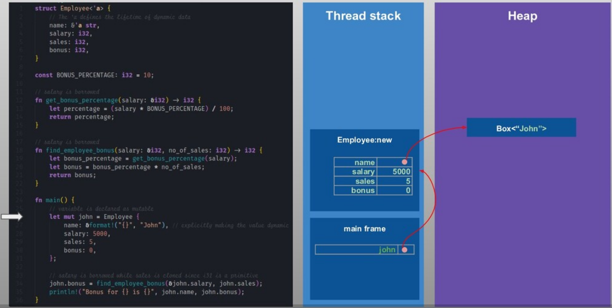
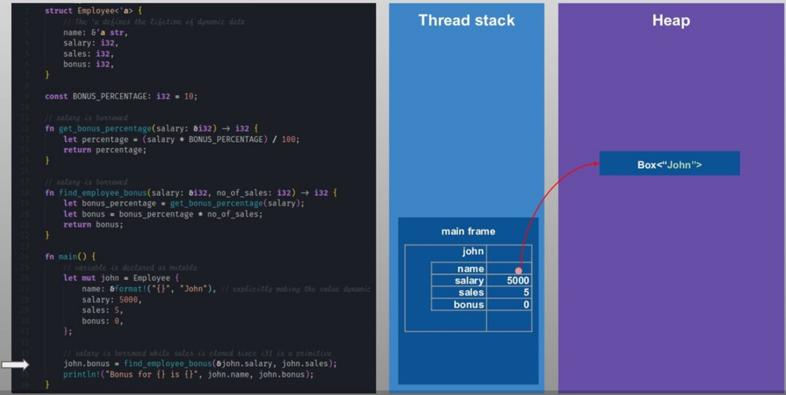
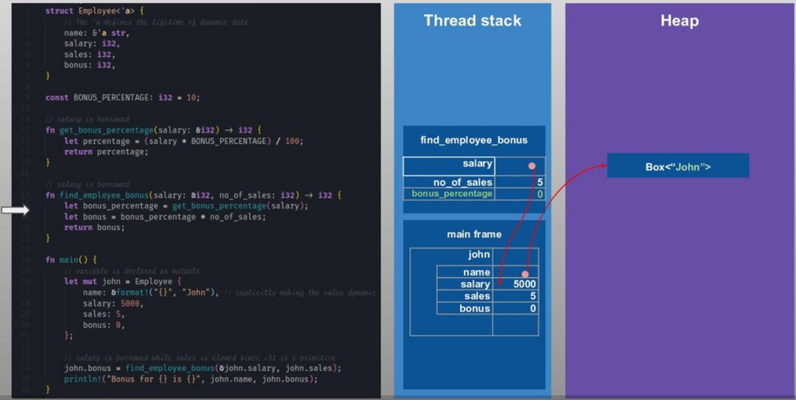
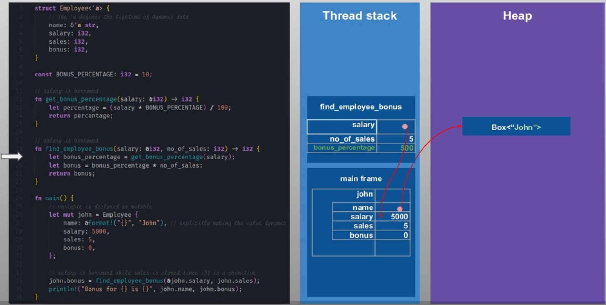

# _Rust_


Cada proceso de un programa en Rust reserva cierta cantidad de memoria virtual por el sistema operativo, esta la la memoria total a la cual un proceso puede tener acceso.


Como se puede observar no hay memoria generacional ni ninguna substructura compleja compleja como los recolectores de basura(`garbage collection`) están involucradas. La razón de esto es que **Rust** maneja la memoria como parte de la ejecución del programa durante el runtime usando el modelo de ``Ownership`` en vez de usar algun tipo de `garbage collection`.

### Heap:
Aquí es donde se guarda todos los datos dinámicos(cualquier dato cuyo tamaño no puede calcularse en tiempo de compilación).  Este es el bloque más grande de memoria y la parte manejada por ``el modelo de Ownership de Rust``.

**Box:**
El tipo ``Box`` es una abstracción para un valor asignado al heap en Rust(``heap-allocated value``). La memoria del heap es reservada(allocated) cuando ```Box::new``` es llamado. Un ```Box<T>``` mantiene un ``smart-pointer`` al espacio de memoria reservado en el heap(heap memory allocated) para el tipo ```T``` y la referencia es guardada en la pila (```stack```).

### Stack:

El área de memoria del stack (stack memory área) es donde se guardan los valores estáticos por defecto. Hay un stack por cada hilo(thread). Los datos estáticos ( datos cuyo tamaño es conocido en tiempo de compilación) incluyen , valores primitivos,function frames (los argumentos pasados a la función, las variables locales de la función, así como la dirección en memoria donde se está ejecutando la función) `Structs` y punteros(`pointers`) a datos dinámicos en el ``Heap``.

### Uso de la memoria en Rust (Stack vs Heap):

Veamos en un ejemplo simple como Rust usa el Stack y el Heap cuando un programa es ejecutado:

```Rust
struct Employee<'a> {
    // The 'a defines the lifetime of the struct. Here it means the reference of `name` field must outlive the `Employee`
    name: &'a str,
    salary: i32,
    sales: i32,
    bonus: i32,
}

const BONUS_PERCENTAGE: i32 = 10;

// salary is borrowed
fn get_bonus_percentage(salary: &i32) -> i32 {
    let percentage = (salary * BONUS_PERCENTAGE) / 100;
    return percentage;
}

// salary is borrowed while no_of_sales is copied
fn find_employee_bonus(salary: &i32, no_of_sales: i32) -> i32 {
    let bonus_percentage = get_bonus_percentage(salary);
    let bonus = bonus_percentage * no_of_sales;
    return bonus;
}

fn main() {
    // variable is declared as mutable
    let mut john = Employee {
        name: &format!("{}", "John"), // explicitly making the value dynamic
        salary: 5000,
        sales: 5,
        bonus: 0,
    };

    // salary is borrowed while sales is copied since i32 is a primitive
    john.bonus = find_employee_bonus(&john.salary, john.sales);
    println!("Bonus for {} is {}", john.name, john.bonus);
}
```

Todos los valores en Rust son asignados(allocated) a la pila(Stack) por defecto. Hay dos excepciones a esto:

1. Cuando el tamaño del dato es desconocido. por ejemplo ``String`` y ``Vectors`` pueden crecer en tamaño en el tiempo o cualquier otro valor dinámico.
2. Cuando manualmente creat un  valor ```Box<T>```  como 
    ```Box::new("Hello")```. Cuando el box sale del scope, su destructor es invocado, el objeto interior es destruido, y la memoria en el Heap liberada.


Veamos como el código anterior es ejecutado y como la memoria en el Stack y el Heap es usada:

**1.**


**2.**


**3.**


**4.**


**5.**


**6.**


**7.**


**8.**


**9.**


**10.**


**11.**


**12.**


**13.**


Una de las características centrales de _Rust_ es el **ownership**. Todos los programas tienen que manejar la manera en la que ellos usan la memoria de la computadora mientras están corriendo. Algunos lenguajes tienen un garbage collector que constantemente busca memoria que ya no se esté usando mientras el programa está corriendo; en otros lenguajes el programador debe de forma explícita alocar y liberar la memoria. _Rust_a usa un tercer enfoque: la memoria es manejadad a través de un sistema de ownership con un conjunto de reglas que el compilador verifica en tiempo de compilación.

**Reglas del Ownership:**

* Cada value en _Rust_ tiene una variable que es llamada **owner**
* Solo puede haber un **owner** a la vez
* Cuando el **owner** se sale del scope el value será soltado.

## **Stack**, **Heap** y _Rust_

En muchos lenguajes de programación, el programador no tiene que pensar sobre el __stack__ y el __heap__ muy a menudo. Pero en lenguajes de programación como _Rust_, donde si un valor está en el stack o en el heap  tiene más efecto en como el lenguaje se comporta y por qué tienes que tomar ciertas deciciones, cobra más protagonismo.

Tanto el __stack__ como el __heap__ son partes de la memoria que hay disponible para que tu código pueda usar en tiempo de ejecución(runtime), pero están estructurados de diferentes formas. El stack guarda valores en el orden em que le llegan y remueve estos valores en el orden opuesto, siguiendo last in, first out(LIFO). Adicionar data al stack es llamado __pushing__ y remover data del stack __popping__. Todos los datos guardados en el stack tienen un tamaño prefijado conocido. Los datos con un tamaño desconocido en tiempo de compilación o con un tamaño que podría cambiar deben ser guardados en el heap. El heap es menos organizado: cuando tu pones datos en el heap, estás requiriendo una cierta cantidad de espacio. El sistema operativo busca un espacio vacío en el heap que es lo suficientemente grande, lo marca como que va a estar en uso, y retorna un __pointer__ , el cual es la dirección en memoria de esa ubicación. Este proceso es llamado __allocating on the heap__ y algunas veces abreviado como solo __allocating__.

Hacer pushing a la stack es más rápido que allocating en el heap debido que el sistema operativo nunca tiene que buscar un lugar para almacenar la nueva data; esa localización siempre está siempre en el tope de la pila(stack). Comparativamente allocating space en el heap requiere más trabajo, debido a que el sistema operativo debe buscar primero un espacio en memoria lo suficientemente grande para mantener la data y luego llevar a cabo un proceso para prepararse para la nueva allocation. Acceder a los datos en el heap es mas lentoo que acceder a los datos en la pila(stack) debido a que tienes que seguir un puntero(pointer) para llegar a ellos.

Hacer un seguimiento de que que partes del código están usando que datos en el heap, minimizando la cantidad de datos duplicados en el heap, y limpiando datos no usados en el heap para que no te quedes sin espacio son todos los problemas que el __ownership__ direcciona.


