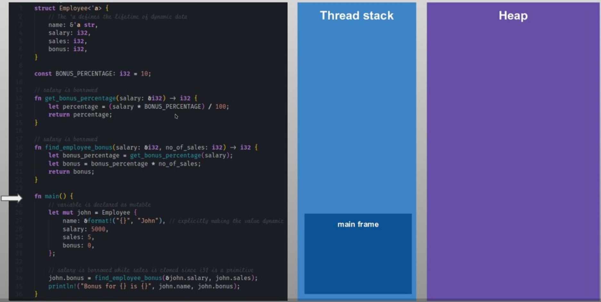
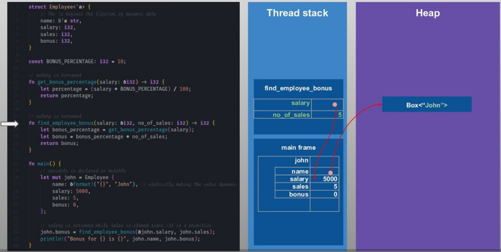
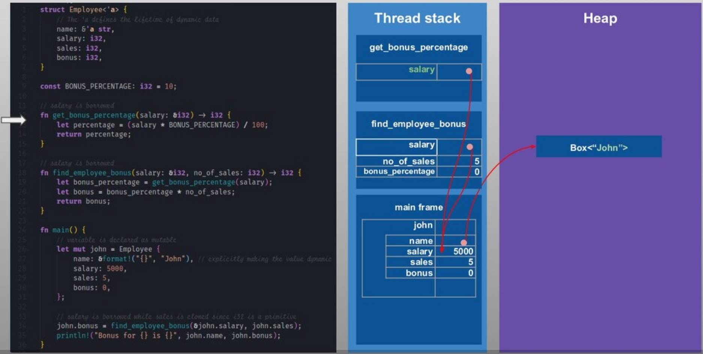
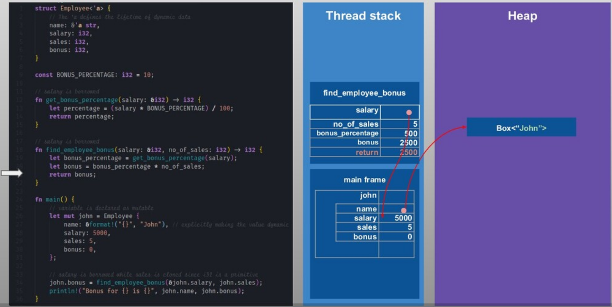

# _Rust_


Cada proceso de un programa en Rust reserva cierta cantidad de memoria virtual por el sistema operativo, esta la la memoria total a la cual un proceso puede tener acceso.


Como se puede observar no hay memoria generacional ni ninguna substructura compleja compleja como los recolectores de basura(`garbage collection`) están involucradas. La razón de esto es que **Rust** maneja la memoria como parte de la ejecución del programa durante el runtime usando el modelo de ``Ownership`` en vez de usar algun tipo de `garbage collection`.

### Heap:
Aquí es donde se guarda todos los datos dinámicos(cualquier dato cuyo tamaño no puede calcularse en tiempo de compilación).  Este es el bloque más grande de memoria y la parte manejada por ``el modelo de Ownership de Rust``.

**Box:**
El tipo ``Box`` es una abstracción para un valor asignado al heap en Rust(``heap-allocated value``). La memoria del heap es reservada(allocated) cuando ```Box::new``` es llamado. Un ```Box<T>``` mantiene un ``smart-pointer`` al espacio de memoria reservado en el heap(heap memory allocated) para el tipo ```T``` y la referencia es guardada en la pila (```stack```).

### Stack:

El área de memoria del stack (stack memory área) es donde se guardan los valores estáticos por defecto. Hay un stack por cada hilo(thread). Los datos estáticos ( datos cuyo tamaño es conocido en tiempo de compilación) incluyen , valores primitivos,function frames (los argumentos pasados a la función, las variables locales de la función, así como la dirección en memoria donde se está ejecutando la función) `Structs` y punteros(`pointers`) a datos dinámicos en el ``Heap``.

### Uso de la memoria en Rust (Stack vs Heap):

Veamos en un ejemplo simple como Rust usa el Stack y el Heap cuando un programa es ejecutado:

```Rust
struct Employee<'a> {
    // The 'a defines the lifetime of the struct. Here it means the reference of `name` field must outlive the `Employee`
    name: &'a str,
    salary: i32,
    sales: i32,
    bonus: i32,
}

const BONUS_PERCENTAGE: i32 = 10;

// salary is borrowed
fn get_bonus_percentage(salary: &i32) -> i32 {
    let percentage = (salary * BONUS_PERCENTAGE) / 100;
    return percentage;
}

// salary is borrowed while no_of_sales is copied
fn find_employee_bonus(salary: &i32, no_of_sales: i32) -> i32 {
    let bonus_percentage = get_bonus_percentage(salary);
    let bonus = bonus_percentage * no_of_sales;
    return bonus;
}

fn main() {
    // variable is declared as mutable
    let mut john = Employee {
        name: &format!("{}", "John"), // explicitly making the value dynamic
        salary: 5000,
        sales: 5,
        bonus: 0,
    };

    // salary is borrowed while sales is copied since i32 is a primitive
    john.bonus = find_employee_bonus(&john.salary, john.sales);
    println!("Bonus for {} is {}", john.name, john.bonus);
}
```

Todos los valores en Rust son asignados(allocated) a la pila(Stack) por defecto. Hay dos excepciones a esto:

1. Cuando el tamaño del dato es desconocido. por ejemplo ``String`` y ``Vectors`` pueden crecer en tamaño en el tiempo o cualquier otro valor dinámico.
2. Cuando manualmente creat un  valor ```Box<T>```  como 
    ```Box::new("Hello")```. Cuando el box sale del scope, su destructor es invocado, el objeto interior es destruido, y la memoria en el Heap liberada.


Veamos como el código anterior es ejecutado y como la memoria en el Stack y el Heap es usada:

**1.**


**2.**


**3.**


**4.**


**5.**


**6.**


**7.**


**8.**


**9.**


**10.**


**11.**


**12.**


**13.**


Como se pudo observar en las imágenes anteriores el Stack es manejado de manera automática y se hace por el sistema operativo en vez de por el mismo Rust. Por lo que no nos debemos preocupar mucho sobre el Stack. El Heap, por otro lado, no se maneja de forma automática por el sistema operativo y comom es el mayor espacio en memoria y guarda los datos dinámicos, este puede crecer exponencialmente causando que nuestro programa al ejecutarse se quede sin memoria disponible. También se fragmenta con el tiempo, lo que ralentiza las aplicaciones. Aquí es donde los pasos del modelo de ownership de Rust para manejar de forma automática la memoria en el ``Heap``.

### Ownership:

Rus tiene una de las maneras más singulares para el manejo de memoria en el Heap y esto es lo que hace a Rust tan especial. Usa un concepto llamado ``ownership`` para manejar memoria.

El ``ownership`` está definido por un conjunto de reglas:
* Cada valor en _Rust_ debe tener una variable como su  **owner**
* Solo puede haber un **owner** para una variable a la vez
* Cuando el **owner** se sale del scope el valor será soltado liberando asi la memoria.


Ejemplo:
```Rust
fn main() {
    let foo = "value"; // owner is foo and is valid within this method
    // bar is not valid here as its not declared yet

    {
        let bar = "bar value"; // owner is bar and is valid within this block scope
        println!("value of bar is {}", bar); // bar is valid here
        println!("value of foo is {}", foo); // foo is valid here
    }

    println!("value of foo is {}", foo); // foo is valid here
    println!("value of bar is {}", bar); // bar is not valid here as its out of scope
}
```

Entonces, al determinar el alcance de las variables con cuidado, podemos asegurarnos de que el uso de la memoria esté optimizado y esta también es la razón por la que Rust te permite usar el alcance de bloque(block scope) en casi todas partes. Esto puede parecer simple, pero en la práctica, este concepto tiene profundas implicaciones en la forma en que se escriben los programas de Rust. Debido a las estrictas reglas del ownership, Rust permite cambiar el ``ownership`` de una variable a otra y es llamado un ``move``. Esto se hace automáticamente al pasar una varibale a una función o al crear una nueva asignación.

Estas reglas son verificadas por el compilador en tiempo de compilación y la liberacióon de memoria ocurre en tiempo de ejecución junto con la ejecución del programa y, por tanto, no hay tiempo adicional de sobrecarga o pausa aquí. 
Una de las características centrales de _Rust_ es el **ownership**. Todos los programas tienen que manejar la manera en la que ellos usan la memoria de la computadora mientras están corriendo. Algunos lenguajes tienen un garbage collector que constantemente busca memoria que ya no se esté usando mientras el programa está corriendo; en otros lenguajes el programador debe de forma explícita alocar y liberar la memoria. _Rust_a usa un tercer enfoque: la memoria es manejadad a través de un sistema de ownership con un conjunto de reglas que el compilador verifica en tiempo de compilación.


