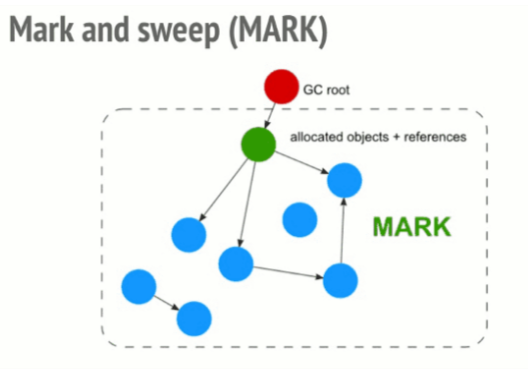
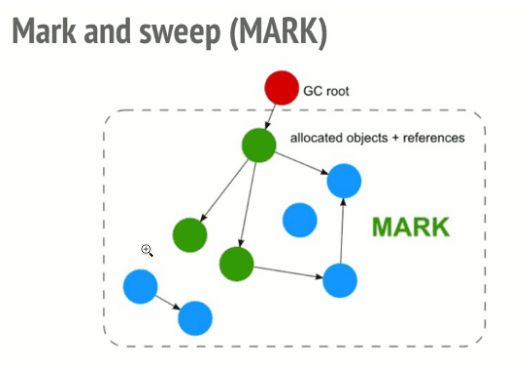
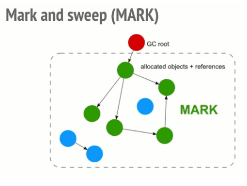

# Seminario 16. Recolección automática de basura 

## Integrantes:

**David Orlando De Quesada Oliva C311**

**Javier Domínguez C312**

**Daniel de la Cruz C311**


# ¿En qué consiste la recolección automática de basura? Contraste contra el manejo manual en C++.  ##


La recolección automática de basura (**Garbage Collection**) es una forma de manejo de memoria, o sea, es un proceso que se encargar de liberar memoria que ha sido reservada, pero a la cual ya no hay ninguna referencia. Cabe destacar que el problema de decidir si un espacio de memoria es "basura", o sea, que no se va a utilizar más, es indecidible, por lo que los **Garbage Collectors** implementan una solución con ciertas restricciones a este problema. Generalmente los lenguajes de programación de alto nivel tienen **Garbage Collector** por defecto, aunque existe la excepción de _C++_ por ejemplo, el cual no lo tiene por defecto, pero se puede incorporar usando una librería. El principio de los **Garbage Collector** es:

1. Determinar que objetos de un programa no van a ser accedidos en el futuro.

2. Liberar la memoria usada por estos objetos.

La memoria que se asigna en tiempo de compilación es almacenada en el
**stack**, mientras que la memoria que se asigna en tiempo de ejecución se almacena en el **heap**. _C++_ nos permite asignar la memoria de una variable en tiempo de ejecución. Esto se conoce como asignación de memoria dinámica. En otros lenguajes de programación como _Java_ y _Python_, el compilador gestiona automáticamente la memoria asignada a cada variable mediante el **Garbage Collector**, y al programador le es indistinto en donde se almacena esta variable, si en el **stack** o en el **heap**, pero este no es el caso en _C++_. En _C++_, si asignamos una variable dinámicamente, necesitamos liberar manualmente la memoria asignada a esta variable después de que no tengamos uso para ella. Podemos asignar y luego liberar memoria dinámicamente usando los operadores **new** y **delete** respectivamente como se muestra a continuación:

```cpp
#include <iostream>

using namespace std;
 
int main ()
{
    // Inicializar puntero NULL
    int* p = NULL;
 
    // reservar memoria para la variable
    p = new(nothrow) int;
    if (!p)
        cout << "allocation of memory failed\n";
    else {
        // Store value at allocated address
        *p = 29;
        cout << "Value of p: " << *p << endl;
    }
 
    // Reservar bloque de memoria usando new
    float *r = new float(75.25);
 
    cout << "Value of r: " << *r << endl;
 
    // Reservando bloque de memoria de tamaño n
    int n = 5;
    int *q = new(nothrow) int[n];
 
    if (!q)
        cout << "allocation of memory failed\n";
    else {
        for (int i = 0; i < n; i++)
            q[i] = i+1;
 
        cout << "Value store in block of memory: ";
        for (int i = 0; i < n; i++)
            cout << q[i] << " ";
    }
 
    // Liberando la memoria reservada para estas variables
    delete p;
    delete r;
 
    // Liberando el bloque de memoria reservado para este array
    delete[] q;
 
    return 0;
}
```

Cabe destacar que el **Garbage Collector** opera sobre el **heap**, no sobre el **stack**.

El **Garbage Collector** tiene sus ventajas y desventajas:

Ventajas:

1. Exime al programador de la responsabilidad de liberar manualmente la memoria (lo que puede causar lo que se conoce como _memory leak_ en lenguajes con manejo de memoria manual como _C/C++_), y le permite enfocarse exclusivamente en el programa, e ignorar por completo el manejo de memoria.

2. Permite reservar memoria para objetos en el **heap** de forma eficiente.

3. Se encarga de liberar la memoria reservada para ciertos objetos que ya no está siendo referenciada, permitiendo así el uso de esta memoria para futuras asignaciones.

4. Proporciona seguridad de memoria, impidiendo que los objetos puedan usar para sí mismos, espacios de memoria reservados para otros objetos.

Desventajas:

Como es lógico el **Garbage Collector** es un programa por lo que consume poder de cómputo a la hora de decidir cuando liberar memoria reservada. El costo a pagar por tener un programa que se encarga de liberar y reservar memoria de forma óptima y automática es lo que se conoce como **overhead** en _Ciencias de la Computación_, que no es más que cualquier combinación de tiempo de cálculo, memoria, ancho de banda u otros recursos en exceso o indirectos que se requieren para realizar una tarea específica, lo que puede llevar a menor o desigual rendimiento, aunque en realidad es menos de lo que se asume que es. Varias investigaciones aseguran que los **Garbage Collector** necesitan 5 veces la memoria para compensar esta deficiencia y para funcionar igual de rápido que el mismo programa corriendo en un lenguaje con manejo explícito de memoria con una declaración ideal de este procedimiento en el código. Pero hay otras personas aseguran que los programadores rara vez escriben código de manejo de memoria de forma eficiente. Por tanto las siguientes propiedades son deseables en un **Garbage Collector**:

1. Debe identificar la mayor parte de la basura.
2. Todo lo que identifique como basura debe ser basura.
3. Debería imponer un costo (**overhead**) de tiempo adicional bajo.
4. Durante la recolección de basura, el programa puede pausarse; estas pausas deben ser breves.

La mayoría de los **Garbage Colector** en la actualidad poseen todas estas propiedades.


# 2. Describa las diferentes estrategias de recolección automática. ¿Cuáles son las ventajas y desventajas de cada una? 


### **Reference Counting (Conteo de referencias)**

__Reference counting__ lo que hace es contar el número de veces que un objeto es referenciado por otro objeto en el sistema. Cuando la referencias a un objeto son removidas, el __reference count__ de ese objeto es decrementado. Cuando el reference count llega a 0, el objeto es liberado(deallocated).


#### Ventajas y desventajas 

La principal ventaja del recuento de referencias sobre el seguimiento de la recolección de basura es que los objetos se reclaman tan pronto como ya no se pueden hacer referencia a ellos, y de manera incremental, sin pausas largas para los ciclos de recolección y con una vida útil claramente definida de cada objeto. En aplicaciones o sistemas en tiempo real con memoria limitada, esto es importante para mantener la capacidad de respuesta. El recuento de referencias también se encuentra entre las formas más sencillas de implementar la gestión de la memoria. También permite una gestión eficaz de los recursos que no son de memoria, como los objetos del sistema operativo, que a menudo son mucho más escasos que la memoria (los sistemas de recolección de basura de rastreo usan finalizadores para esto, pero la recuperación retrasada puede causar problemas). Los recuentos de referencia ponderados son una buena solución para la recolección de basura en un sistema distribuido.

Los recuentos de referencias también son información útil para usar como entrada para otras optimizaciones de tiempo de ejecución. Por ejemplo, los sistemas que dependen en gran medida de objetos inmutables, como muchos lenguajes de programación funcional, pueden sufrir una penalización de eficiencia debido a las copias frecuentes. Sin embargo, si el compilador (o el sistema de tiempo de ejecución) sabe que un objeto en particular tiene solo una referencia (como hace la mayoría en muchos sistemas), y que la referencia se pierde al mismo tiempo que se crea un nuevo objeto similar (como en la sentencia de adición de cadena ```str ← str + "a"```), puede reemplazar la operación con una mutación en el objeto original.

El recuento de referencia tiene dos desventajas  fundamentales sobre la recoleccion de basura restreo, las cuales requieren mecanismos adicionales para mejorarlas. 

  - Las frecuentes actualizaciones que implica son una fuente de ineficiencia. Si bien el seguimiento de los recolectores de basura puede afectar gravemente la eficiencia a través del cambio de contexto y las fallas de la línea de caché, se recolectan con relativa poca frecuencia, mientras que el acceso a los objetos se realiza de forma continua. Además, lo que es menos importante, el recuento de referencias requiere que cada objeto gestionado por memoria reserve espacio para un recuento de referencias. Al rastrear recolectores de basura, esta información se almacena implícitamente en las referencias que hacen referencia a ese objeto, ahorrando espacio, aunque rastrear recolectores de basura, particularmente los incrementales, puede requerir espacio adicional para otros propósitos.
 
  - El algoritmo ingenuo descrito anteriormente no puede manejar ciclos de referencia, un objeto que se refiere directa o indirectamente a sí mismo. Un mecanismo que se base exclusivamente en recuentos de referencias nunca considerará cadenas cíclicas de objetos para su eliminación, ya que se garantiza que su recuento de referencias no será cero. Existen métodos para abordar este problema, pero también pueden aumentar la sobrecarga y la complejidad del recuento de referencias; por otro lado, estos métodos solo deben aplicarse a datos que pueden formar ciclos, a menudo un pequeño subconjunto de todos los datos. Uno de esos métodos es el uso de referencias débiles, mientras que otro implica el uso de un algoritmo de barrido de marcas que se llama con poca frecuencia para limpiar.

El recuento de referencias por sí solo no puede mover objetos para mejorar el rendimiento de la caché, por lo que los recolectores de alto rendimiento también implementan un recolector de basura de seguimiento. La mayoría de las implementaciones (como las de PHP y Objective-C) tienen un rendimiento de caché deficiente, ya que no implementan la copia de objetos.

#### Ejemplos de uso 

 - **C++** no realiza el recuento de referencias de forma predeterminada, cumpliendo con su filosofía de no agregar funcionalidad que pueda incurrir en gastos generales donde el usuario no lo ha solicitado explícitamente. Se puede acceder a los objetos que se comparten pero que no son de propiedad a través de una referencia, un puntero sin formato o un iterador (una generalización conceptual de punteros). 
 
 - **Delphi** En su mayoría, Delphi no es un lenguaje de recolección de basura, en el sentido de que los tipos definidos por el usuario aún deben asignarse y desasignarse manualmente, sin embargo, proporciona una recopilación automática mediante el recuento de referencias para algunos tipos integrados, como cadenas, matrices dinámicas e interfaces, para facilitar su uso y simplificar la funcionalidad de la base de datos genérica. Depende del programador decidir si utilizar los tipos integrados; Los programadores de Delphi tienen acceso completo a la gestión de memoria de bajo nivel como en C / C ++. Por lo tanto, todo el costo potencial del recuento de referencias de Delphi puede, si se desea, eludir fácilmente.
 - **Perl** también usa el conteo de referencias, sin ningún manejo especial de referencias circulares, aunque (como en Cocoa y C ++), Perl admite referencias débiles, lo que permite a los programadores evitar la creación de un ciclo.

 - **Python** también utiliza el recuento de referencias y también ofrece detección de ciclos (y puede recuperarlos) 


## Mark-and-sweep (Marcado y barrido)

Este algoritmo reduce la definición de "un objeto ya no es necesitado" a "un objeto es inalcanzable". Primeramente debe poder detectar todos los objetos inalcanzables y, en segundo lugar, debe recuperar el espacio del heap usado por los objetos basura y hacer que dicho espacio vuelva a estar disponible para el programa. El algoritmo de `Mark and Sweep` realiza estas operaciones en las siguientes dos fases:

* Marcado(`Mark phase`)
* Barrido(`Sweep phase`)

**Fase 1:Marcado**(`Mark phase`)

Cuando un objeto es creado, su `mark bit` se establece como `0`(false). En la fase de Marcado,  seteamos el `mark bit` de todos los objetos alcanzables a `1`(true). Para hacer esto operación simplemente necesitamos hacer un recorrido en un grafo, un DFS funcionaría en este caso. Si consideramos cada objeto como un nodo y luego se visitan todos los nodos(objetos) que son accesibles desde este node(objeto) y así se continúa hasta que hayamos visitida todos los nodos accesibles.

* La raíz es una variable que se refiere a un objeto y es directamente accesible por una variable local. Supondremos que tenemos una sola raíz.
* Podemos acceder al mark bit de un objeto mediante `markedBit(obj)`
  

**Pseudocódigo Mark Phase:**
```
Mark(root)
If markedBit(root) = false then
                     markedBit(root) = true
                                       For each v referenced by root
                                       Mark(v)
```

**Si tenemos más de una raíz, simplemente tenemos que llamar a Mark() para todas las varibles raíz (root variables).**

**Fase 2: Barrido(Sweep Phase)**

Como el nombre sugiere, "barre" los objetos inalcanzables, es decir, limpia la memoria en el heap para todos los objetos inalcanzables. Todos aquellos objetos cuyo valor marcado se establece en `false` son borrados de la memoria del heap, para todos los demás objetos(objetos alcanzables) el bit marcado se establece en `false`. Ahora el `mark value` para todos los objetos alcanzables se establece en `false`, ya que ejecutaremos el algoritmo(si es necesario) y nuevamente pasaremos por la fase de marcado para marcar todos los objetos alcanzables.

**Pseudocódigo Sweep Phase:**
```
Sweep()
For each object p in heap
If markedBit(p) = true then
                  markedBit(p) = false
                                 else
                                     heap.release(p)
```

El `algoritmo de mark-and-sweep` se denomina `tracing garbage collector` porque rastrea la colección completa de objetos a los que el programa puede acceder directa o indirectamente.


La siguiente visualización muestra el proceso:

``1.``


``2.``


``3.``


``4.``


``5.``


``6.``


## Traicing garbage collection

Traicing garbage collection es una forma de manejo de memoria automática que consiste en determinar que objetos deben ser liberados. Rastreando que objetos son alcanzables por una cadena de referencias de ciertas objetos "root", y considerando el resto como "basura" y recolectando estos. Traicing garbage collection es la forma mas común de recolección de basura, tanto es así que "garbage collection" se refiere a "traicing garbage collection", en lugar de a otros métodos como el conteo de referencias, y hay una gran cantidad de algoritmos utilizados en la implementación.

## Accecibilidad de un objeto

Informalmente un objeto es accesible si este es referenciado por al menos una variable en el programa, ya sea directamente o mediante referencias de otros objetos accesibles. Más especificamente, se puede acceder a los objetos solo de dos formas:

- Un distiguido conjunto de roots: objetos que son asumidos son alcanzables. Típicamente, eso include todos los objetos referenciados de cualquier parte en la "Pila de llamadas"(que son todas las variables y parámetros locales en la función que se estan invocando actualmente) y cualquier variable global.
- cualquier referencia de un objeto accesible es accesible, más formalmente, la accesibilidad es transitiva.

La definición de accesibilidad de "basura" no es óptima, en la medida en que la última vez que un programa usa un objeto podría ser mucho antes de que ese objeto caiga fuera del alcance del entorno. A veces se hace una distinción entre basura sintáctica (aquellos objetos que el programa posiblemente no pueda alcanzar) y basura semántica (esos objetos que el programa nunca volverá a usar)

El problema de identificar con precisión la basura semántica es parciamente decidible: un programa que asigna un objeto `x`, ejecuta un programa de entrada arbitrario `p` termina, requeriria un recolector de basura semántica para resolver resolver el problema de la detección. Aunque los métodos heurísticos conservadores para las detección de basura semántica siguen siendo un área de investigación activa, escencialmente todos los recolectores de basura prácticos se enfocan en la basura sintáctica.

Otra complicación con este enfoque es que, en lenguajes con tipos de referencia y tipos por valor sin caja, el recolector de basura necesita de alguna manera poder distinguir que variables en la pila o campos en un objeto son valores regulares y cuales son referencias: en la memoria, un número entero y una referencia pueden parecerse. El recolector de basura necesita saber si tratar el elemento como una referencia y seguirlo, o si es un valor primitivo. Una solución común es el uso de punteros etiquetados.

## Colecciones débiles (Weak collections)

Se pueden diseñar estructuras de datos que tengan características de seguimiento débiles. Por ejemplo las tablas hash débil son útiles. Al igual que la tablas Hash normal, una tabla hash débil mantiene una asociación entre un par de objetos, donde cada clave se entiende como una clave y un valor. Sin embargo la tabla hash no mantiene una referencia sólida sobre estos objetos. Se produce un comportamiento especial cuando la clave, el valor o ambos, se convierten en basura: la entrada de la tablas hash se elimina espontáneamente. Existen más refinamientos, como tablas hash que solo tienen claves débiles(las referencias de valor son referencias ordinarias, fuertes) o solo valores débiles(las referencias de claves son fuertes)

Las tablas hash débiles son importantes para mantener asociaciones entre objetos, de modo que los objetos involucrados en la asociación aún pueden convertirse en basura si ya nada en el programa se refiere a ellos (aparte de la tabla hash asociada).

El uso de una tabla hash regular para tal propósito podría conducir a una "pérdida de memoria lógica": la acumulación de datos alcanzables que el programa no necesita y no usará.

## Rendimiento (Performance)

El rendimiento de los recolectores de basura de seguimiento, tanto la latencia como el rendimiento, depende significativamente de la implementación, la carga de trabajo y el entorno. Las implementaciones lazy o el uso en entornos con mucha memoria restringida, especialmente los sistemas integrados, pueden resultar en un rendimiento muy deficiente en comparación con otros métodos, mientras que las implementaciones sofisticadas y el uso en entornos con mucha memoria puede dar como resultado un rendimiento excelente.

En términos de rendimiento el seguimiento, por su naturaleza, requiere una sobrecarga de tiempo de ejecución implícita, aunque en algunos casos el costo amortizado puede ser extremadamente bajo, en algunos casos incluso menor que una instrucción por asignación o colección, superando la asignación de pila. La gestión manual de la memoria requiere sobrecarga debido a la liberación explícita de memoria, y el recuento de referencias tiene sobrecarga por incrementar y disminuir los recuentos de referencia y comprobar si el recuento se ha desbordado o ha caído a cero.

En términos de latencia, los recolectores de basura simple de "stop-the-world" pausan la ejecución del programa para la recolección de basura, lo que puede suceder en momentos arbitrarios y tomar un tiempo arbitrario, lo que los hace inutilizable para la computación en tiempo real, especialmente los sistemas integrados, y no se ajustan bien a los sistemas interactivos o cualquier situación en la que la baja latencia sea una prioridad. Sin embrago, los recolectores de basura incrementales pueden proporcionar garantías estrictas en tiempo real y en sistemas con tiempo de inactividad frecuente y suficiente memoria libre, como computadoras personales, la recoleccion de basura se puede programar tiempos de inactividad y tener un impacto mínimo en el rendimiento interactivo. La administración de memoria manual (como en _C++_) y el conteo de referencias tienen un problema similar de pausas arbitrariamente largas en caso de desasignar una estructura de datos grande y todos sus elementos secundarios, aunque esto solo ocurre en momentos fijos, no dependiendo de la recolección de basura.

Algunos avances en la recolección de basura pueden entenderse como reacciones a problemas de rendimiento. Los primeros recolectores eran recolectores de "stop-the-world", pero el rendimiento de este enfoque distraía la atención de las aplicaciones interactivas. La recolección incremental evito esta interrupción, pero a costa de una menor eficiencia debido a la necesidad de barreras. Las técnicas de recolección generacional se utilizan con recolectores incrementales y "stop-the-world" para aumentar el rendimiento, la compensación es que parte de la basura no se detecta como tal durante más tiempo de lo normal.


# 3. Enumere brevemente las propuestas más comunes en los lenguajes de programación C#,Python, Java, Go y JavaScript.


## _C#_

La gestión automática de la memoria es posible gracias a Garbage Collection en .NET Framework. Cuando se crea un objeto de clase en tiempo de ejecución, se le asigna cierto espacio de memoria en la memoria del **heap**. Sin embargo, después de que todas las acciones relacionadas con el objeto se hayan completado en el programa, el espacio de memoria asignado es un desperdicio, ya que no se puede utilizar. En este caso, la **recolección de basura** es muy útil ya que libera automáticamente el espacio de memoria cuando ya no es necesario.
La **recolección de basura** siempre funcionará en Managed **Heap** e internamente tiene un motor que se conoce como el motor de optimización.

La **recolección de basura** se produce si se cumple al menos una de varias condiciones. Estas condiciones se dan de la siguiente manera:

* Si el sistema tiene poca memoria fisica, entonces las recoleccion de basura es necesaria.
* Si la memoria asignada a varios objetos en la memoria del **heap** excede un el espacio preestablecido, entonces ocurre la **recolección de basura**.
* Si se llama al método ```gc.Collect```, se produce la **recolección de basura**. Sin embargo, este método solo se llama en situaciones inusuales, ya que normalmente el recolector de basura se ejecuta automáticamente.

Existen 3 fases principales en la recoleccion de basura:
   **Marking Phase(Fase de marcado):** se crea una lista de todos los objetos activos durante la fase de marcado. Esto se hace siguiendo las referencias de todos los objetos raíz. Todos los objetos que no están en la lista de objetos activos se eliminan potencialmente de la memoria del **heap**.
   **Relocating Phase(Fase de reubicación):**: Las referencias de todos los objetos que estaban en la lista de todos los objetos vivos se actualizan en la fase de reubicación para que apunten a la nueva ubicación donde se reubicarán los objetos en la fase de compactación. 
   **Compacting Phase(Fase de compactación)**: El **heap** se compacta en la fase de compactación a medida que se libera el espacio ocupado por los objetos muertos y se mueven los objetos vivos restantes. Todos los objetos activos que quedan después de la recolección de elementos no utilizados se mueven hacia el extremo anterior de la memoria del **heap** en su orden original.

La memoria del **heap** está organizada en 3 generaciones para que varios objetos con diferentes tiempos de vida puedan manejarse apropiadamente durante la **recolección de basura**. Common Language Runtime (CLR) proporcionará la memoria a cada generación en función del tamaño del proyecto. Internamente, Optimization Engine llamará al método de medios de recolección para seleccionar qué objetos entrarán en la generación 1 o la generación 2.

- **Generación 0:** todos los objetos de corta duración, como las variables temporales, están contenidos en la generación 0 de la memoria del **heap**. Todos los objetos recién asignados también son objetos de generación 0 implícitamente a menos que sean objetos grandes. En general, la frecuencia de **recolección de basura** es la más alta en la generación 0. 
- **Generación 1:** si el espacio ocupado por algunos objetos de generación 0 que no se liberan en una ejecución de **recolección de basura**, estos objetos se mueven a la generación 1. Los objetos de esta generación son una especie de búfer entre los objetos de corta duración en la generación 0 y los objetos longevos de la generación 2. 
- **Generacion 2:** si el espacio ocupado por algunos objetos de la generación 1 que no se liberan en la siguiente ejecución de **recolección de basura**, estos objetos se mueven a la generación 2. Los objetos de la generación 2 tienen una vida larga, como los objetos estáticos, ya que permanecen en la memoria del **heap**. durante todo el proceso.

La **recolección de basura** de una generación implica la **recolección de basura** de todas sus generaciones más jóvenes. Esto significa que se liberan todos los objetos de esa generación en particular y sus generaciones más jóvenes. Por este motivo, la recolección de elementos no utilizados de la generación 2 se denomina recolección de elementos no utilizados completa, ya que se liberan todos los objetos de la memoria dinámica. Además, la memoria asignada a la Generación 2 será mayor que la memoria de la Generación 1 y, de manera similar, la memoria de la Generación 1 será mayor que la memoria de la Generación 0 (Generación 2> Generación 1> Generación 0).


## _Python_

El proceso de reservar y liberar memoria en _Python_ es automático. El programador no tiene que reservar o Liberar memoria a diferencia de lenguajes con mecanismos de reserva dinámica de memoria como _C_ y _C++_. _Python_ usa dos estrategias para la reserva de memoria:

* Reference Counting
* Garbage Collection

**Reference Couting:**

Por ejemplo, supongamos que tenemos 2 o más variables que tienen el mismo valor, entonces, lo que la máquina virtual de _Python_ hace es, en vez de crear otro objeto del mismo valor en el **heap** privado, en realidad hace que la segunda variable apunte al valor que originalmente existía en el **heap** privado. Por lo tanto, en el caso de clases, tener un número de referencias puede ocupar una gran cantidad de espacio en memoria, en dicho caso referencing counting es altamente beneficioso para preservar la memoria disponible para otros objetos.
### Ejemplo 1:

```Python
x = 10
```

Cuando ```x = 10```  se ejecuta un objeto de tipo integer 10 es creado en memoria y su referencia es asignada a la variable x, esto es debido a que todo es un objeto en _Python_.


Verifiquemos que esto sea verdadero.

```Python

x = 10
y = x
  
if id(x) == id(y):
    print("x and y refer to the same object")
```

Output:
```
x and y refer to the same object
```

En el ejemplo anterior, ``y = x`` crea otra variable de referencia y la cual hace referencia al mismo objeto debido a que _Python_ optimiza la utilización de memoria haciendo la asignación (allocation) de una mismo referencia de un objeto a una nueva variable si este objeto ya existia previamente con el mismo valor.


Ahora cambiemos el valor de ``x``  y veamos que pasa.

```Python

x = 10
y = x
x += 1
  
if id(x) != id(y):
    print("x and y do not refer to the same object")
```

```Python
x and y do not refer to the same object
```

Entonces, ahora ``x`` referencia a un nuevo objeto ``x`` y la conexión entre ``x`` y ``10`` se pierde pero ``y`` sigue
referenciando a ``10``


### Ejemplo 2:

```Python

# Literal 9 is an object
b = 9
 
# Reference count of object 9
# becomes 0.
b = 4
```

El valor literal 9 es un objeto. El __reference count__ del objeto 9 es incrementado a 1 en la línea 1. En la línea 2 este reference count llega  a 0 y es desreferenciado el objeto. Por tanto el garbage collector libera(deallocates) el objeto.

Formas de hacer un objeto ilegible para el ``garbage collection``:

```Python
x = []
x.append(l)
x.append(2)
 
# delete the list from memory or
# assigning object x to None(Null)
del x
# x = None
```

El reference count para la lista creada es ahora 2. Sin embargo, no puede ser alcanzado desde dentro de _Python_ y no puede ser posible usarlo de nuevo, esto es considerado basura(garbage). Esta lista por tanto nunca es liberada(freed).

### Garbage collection automática de ciclos:

Debido que a los ciclos de referencia(reference cycles) toman un costo computacional para descubrirse, el garbage collection debe ser una actividad programada. _Python_ programa el garbage collection basado en la cantidad límite(threshold) de objetos asignados(object allocations) y objetos liberados(object deallocations). Cuando el número de alloctions menos el número de dealloactions es mayor que el threshold, el garbage collector se ejecutará. Uno puede inspeccionar el threshold para nuevos objetos importando en módulo  ``recolección de basura`` y preguntando por el garbage collection thresholds:

```Python
# loading gc
import gc
 
# get the current collection
# thresholds as a tuple
print("Garbage collection thresholds:",
                    gc.get_threshold())
```

Output:
```
Garbage collection thresholds: (700, 10, 10) 
```

Aquí, el ``threshold`` por defecto en el sistema es 700. Esto significa que el número de allocations vs el número de deallocations tiene que ser mayor que 700 para que el garbage collector automático se ejecute. Por esto qualquier porción de tu código que libere gran cantidad de bloques de memoria es un buen candidato por correr el ``garbage collection`` manual.

### Garbage Collection Manual:

La invocación de forma manual del garbage collector durante la ejecución de un programa puede ser una buena idea en como el manejo de memoria puede ser comsumido por ciclos de referencia.

El garbage collection puede ser invocado de forma manual de la siguiente manera:

```Python

# Importing gc module
import gc
 
# Returns the number of
# objects it has collected
# and deallocated
collected = gc.collect()
 
# Prints Garbage collector
# as 0 object
print("Garbage collector: collected",
          "%d objects." % collected)
```

Output:
```
('Garbage collector: collected', '0 objects.')
```

Si pocos ciclos son creados, como el trabaja el colector de forma manual:

```Python

import gc
i = 0
 
# create a cycle and on each iteration x as a dictionary
# assigned to 1
def create_cycle():
    x = { }
    x[i+1] = x
    print x
 
# lists are cleared whenever a full collection or
# collection of the highest generation (2) is run
collected = gc.collect() # or gc.collect(2)
print "Garbage collector: collected %d objects." % (collected)
 
print "Creating cycles..."
for i in range(10):
    create_cycle()
 
collected = gc.collect()
 
print "Garbage collector: collected %d objects." % (collected)
```

Output:

```
Garbage collector: collected 0 objects.
Creating cycles...
{1: {...}}
{2: {...}}
{3: {...}}
{4: {...}}
{5: {...}}
{6: {...}}
{7: {...}}
{8: {...}}
{9: {...}}
{10: {...}}
Garbage collector: collected 10 objects.
```

Hay 2 formas de realizar el garbage collection de forma manual : basado en el tiempo(``time-based``) y basado en un evento(``event-based``)

1. **Time-based**: Es simple el garbage collector es llamado luego de un intervalo de tiempo prefijado.
2. **Even-based**: Se llama al garbage collector dada la ocurrencia de un evento. Por ejemplo, cuando un usuario cierra la aplicación o cuando la aplicación entra en un estado ``idle``.


## _Java_

Las aplicaciones _Java_ obtienen objetos en la memoria según sea necesario. La tarea de la **recolección de basura** (**Garbage Collection**) en la máquina virtual de _Java_ (JVM) es determinar automáticamente qué memoria ya no está siendo utilizada por una aplicación _Java_ y reciclar esta memoria para otros usos. Debido a que la memoria se recupera automáticamente en la JVM, los desarrolladores de aplicaciones _Java_ no tienen que tener que liberar explícitamente los objetos de memoria que no se utilizan.

La operación de **recolección de basura** se basa en la premisa de que la mayoría de los objetos utilizados en el código _Java_ son de corta duración y pueden recuperarse poco después de su creación. Debido a que los objetos sin referencia se eliminan automáticamente de la memoria del **heap**, la **recolección de basura** hace que _Java_ sea eficiente en la memoria.

Hay dos tipos de **recolección de basura** que generalmente ocurren en _Java_:

* Se dice que se ha producido una **recolección de basura** menor o incremental cuando se eliminan los objetos inalcanzables en la memoria del **heap** de generación joven.
* Se dice que se ha producido una **recolección de basura** mayor o completa cuando se eliminan los objetos que sobrevivieron a la **recolección de basura** menor y se copiaron en la memoria del **heap** de generación anterior o permanente. En comparación con la generación joven, la **recolección de basura** completa ocurre con menos frecuencia en la generación anterior.

Para liberar memoria, la JVM debe detener la ejecución de la aplicación durante al menos un breve período de tiempo y ejecutar **recolección de basura**. Este proceso se llama "stop-the-world". Esto significa que todos los subprocesos, excepto los subprocesos de , dejarán de ejecutarse hasta que se ejecuten los subprocesos de **recolección de basura** y el recolector de basura libere los objetos.

Las implementaciones modernas de **recolección de basura** intentan minimizar las detenciones en la ejecución del programa como consecuencia del "stop-the-world" haciendo todo el trabajo posible en segundo plano (es decir, utilizando un hilo separado), por ejemplo, marcando instancias de basura inaccesibles mientras el proceso de la aplicación continúa ejecutándose.

Las JVM modernas como **Azul Zing** utilizan el colector de compactación continuamente concurrente (C4), que elimina las pausas de recolección que limitan la escalabilidad en el caso de las JVM convencionales.

La JVM tradicional de Oracle HotSpot tiene cuatro formas de realizar la actividad de **recolección de basura**:

* Serie donde solo un hilo ejecutó el GC
* Paralelo donde se ejecutan varios subprocesos menores simultáneamente, cada uno de los cuales ejecuta una parte de la **recolección de basura**.
* Concurrent Mark Sweep (CMS), que es similar al paralelo, también permite la ejecución de algunos subprocesos de aplicación y reduce la frecuencia del "stop-the-world".
* G1, que también se ejecuta en paralelo y al mismo tiempo, pero funciona de manera diferente a CMS.

## _Go_

Primero que todo el recolector de basura de _Go_ es un recolector de basura **no generacional**, **concurrente**, **tricolor** de **marca y barrido**.

 _Go_ prefiere asignar memoria en el **stack**, por lo que la mayoría de las asignaciones de memoria terminarán allí. Esto significa que _Go_ tiene una **stack** por **goroutine** y, cuando sea posible, _Go_ asignará variables a esta **stack**. El compilador de _Go_ intenta probar que no se necesita una variable fuera de la función realizando un análisis de escape para ver si un objeto "escapa" de la función. Si el compilador puede determinar la duración de una variable, se asignará a una **stack**. Sin embargo, si la vida útil de la variable no está clara, se asignará en el **heap**. Generalmente, si un programa _Go_ tiene un puntero a un objeto, ese objeto se almacena en el **heap**.

 La hipótesis generacional asume que los objetos de corta duración, como las variables temporales, se liberan con mayor frecuencia. Por lo tanto, un **Garbage Collector** generacional se centra en los objetos asignados recientemente. Sin embargo, mencionamos previamente, las optimizaciones del compilador permiten que el compilador de _Go_ asigne objetos con una vida útil conocida al **stack**. Esto significa que habrá menos objetos en el **heap**, por lo que se recolectarán menos objetos como basura. Esto significa que un **Garbage Collector** generacional no es necesario en _Go_. Entonces, _Go_ usa un recolector de basura no generacional. Concurrente significa que el **Garbage Collector** se ejecuta al mismo tiempo que los restantes hilos del programa. Por lo tanto, _Go_ utiliza un recolector de basura **concurrente**, **no generacional**, **marca y barrido** (mark and sweep) es el tipo de **Garbage Collector** y **tricolor** es el algoritmo utilizado para implementar esto.

## _JavaScript_

La noción principal de los algoritmos de recolección se basan en la noción de ``referencia``.  Dentro del contexto de gestión de memoria, se dice que un objeto hace referencia a otro si el primero tiene acceso al segundo (ya sea de forma implícita o explícita). Por ejemplo, un objeto de _JavaScript_ guarda una referencia a su prototipo (``referencia implícita``) y a cualquiera de los valores de sus propiedades (``referencia explícita``).

Hay que mencionar que en este contexto la noción de "objeto" se refiere a algo más amplio que los objetos normales de _JavaScript_ y que también incluye al ámbito de la función (o ámbito de léxico global).

## Usando conteo por referencias

Éste es el algoritmo de recolección más simple. Este algoritmo reduce la definición de "un objejo ya no es necesario" a "un objeto ya no tiene ningún otro objeto que lo referencie". Un objeto es considerado recolectable si existen cero referencias hacia él.

Ejemplo 1:

```Javascript
var o = {
  a: {
    b:2
  }
};
// Se crean dos objetos. Uno es referenciado por el otro como
// una de sus propiedades.
// El otro es referenciado al ser asignado a la variable "o"
// Ninguno puede ser recolectado.


var o2 = o; // la variable "o2" es lo segundo en tener una
            // referencia al objeto.
o = 1;      // ahora el objeto solo tiene una referencia mediante
            // la variable "o2"

var oa = o2.a; // referencia a la propiedad "a" del objeto.
               // ahora el objeto posee dos referencias, una como propiedad
               // la otra como la variable "oa"

o2 = "yo"; // el objeto original "o" ahora ya no tiene
           // referencias a él. Podría ser recolectado.
           // Sin embargo lo que había en la propiedad "a" aún
           // esta refernciado en la variable "oa";
           // no puede ser recolectado aún

oa = null; // lo que estaba en la propiedad "a" del objeto original "o"
           // ahora ya no tiene ninguna referencia.Puede ser recolectado.
```

Limitación : ciclos

Existe una limitación cuando se trata de ciclos.

```Javascript
function f(){
  var o = {};
  var o2 = {};
  o.a = o2; // o referencía o2
  o2.a = o; // o2 referencía o

  return "azerty";
}

f();
// Dos objetos son creados y se referencían uno al otro creando un ciclo
// Estan atrapados en el scope de la funcion después de la llamada
// por lo que son inútiles fuera de la función y podrían ser recolectados.
// Sin embargo, el algoritmo de conteo de referencias considera que como
// ambos objetos estan referenciados (aunque sean a si mismos) ambos
// siguen en uso y por lo tanto no pueden ser recolectados.

```

 En el ejemplo anterior dos objetos son creados y se referencían entre ellos, por lo que se crea un ciclo. Ellos no saldrán del ámbito de la función después del llamado de la función, con lo que serían efectivamente "ya no son necesarios" y por lo cual ser liberados. Sin embargo, el algoritmo de conteo de referencias considera que ya que cada uno de los dos objetos está referenciado por lo menos una vez, ninguno podra ser recolectado. Este simple algoritmo tiene la limitación de que si un grupo de objetos se referencian a sí mismos (y forman un ciclo), nunca pasarán a "ya no ser necesitados" y no podrán ser recolectados nunca.

Internet Explorer 6 y 7 son conocidos por tener recolectores de basura por conteo de referencias para los objetos del ``DOM``. Los ciclos son un error común que pueden generar fugas de memoria (memory leaks).

Ejemplo 2:

```Javascript
var div;
window.onload = function(){
  div = document.getElementById("miDiv");
  div.referenciaCircular = div;
  div.muchosDatos = new Array(10000).join("*");
};
```

En el ejemplo anterior, el elemento del DOM "miDiv" posée una referencia circular a sí mismo en la propiedad "referenciaCircular". Si la propiedad no es explícitamente removida o asignada con el valor null,  un algoritmo de conteo de referencias siempre va a dejar por lo menos una referencia intacta y va a mantener el elemento del DOM activo en memoria incluso cuando es removido del DOM. Si el objeto del DOM contiene una gran cantidad de datos (ejemplificado en la propiedad "muchosDatos"), la memoria consumida por estos datos nunca será liberada.

### Mark-and-sweep:


Este algoritmo asume la noción de un grupo de objetos llamados objetos raíz (en _JavaScript_ la raíz es el objeto global). Periódicamente el recolector empieza por estas raíces, encuentra todos los objetos que están referenciados por estas raíces, y luego todos los objetos referenciados de estos, etc. Empezando por las raíces, el recolector de esta forma encontrará todos los objetos que son alcanzables y recolectará los objetos inalcanzables.

Este algoritmo es mejor que el anterior ya que "un objeto tiene cero referencias" equivale al "objeto es inalcanzable". Esto no sucedía asi en el algoritmo anterior cuando se trataba de un ciclo.

Desde el 2012, todos los navegadores incluyen un recolector de basura basado en mark-and-sweep. Todas las mejoras realizadas en el campo de Recolección de basura en _JavaScript_ (recolección generacional/incremental/concurrida/paralela) en los ultimos años son mejoras a la implementación del algoritmo, pero no mejoras sobre el algoritmo de recolección ni a la reducción de la definicion de cuando "un objeto ya no es necesario".
# 4. (Opcional) Explique el manejo de memoria en Rust.

Cada proceso de un programa en Rust reserva cierta cantidad de memoria virtual por el sistema operativo, esta la la memoria total a la cual un proceso puede tener acceso.


Como se puede observar no hay memoria generacional ni ninguna substructura compleja compleja como los recolectores de basura(`garbage collection`) están involucradas. La razón de esto es que **Rust** maneja la memoria como parte de la ejecución del programa durante el runtime usando el modelo de ``Ownership`` en vez de usar algun tipo de `garbage collection`.

### Heap:
Aquí es donde se guarda todos los datos dinámicos(cualquier dato cuyo tamaño no puede calcularse en tiempo de compilación).  Este es el bloque más grande de memoria y la parte manejada por ``el modelo de Ownership de Rust``.

**Box:**
El tipo ``Box`` es una abstracción para un valor asignado al heap en Rust(``heap-allocated value``). La memoria del heap es reservada(allocated) cuando ```Box::new``` es llamado. Un ```Box<T>``` mantiene un ``smart-pointer`` al espacio de memoria reservado en el heap(heap memory allocated) para el tipo ```T``` y la referencia es guardada en la pila (```stack```).

### **Stack:**

El área de memoria del stack (stack memory área) es donde se guardan los valores estáticos por defecto. Hay un stack por cada hilo(thread). Los datos estáticos ( datos cuyo tamaño es conocido en tiempo de compilación) incluyen , valores primitivos,function frames (los argumentos pasados a la función, las variables locales de la función, así como la dirección en memoria donde se está ejecutando la función) `Structs` y punteros(`pointers`) a datos dinámicos en el ``Heap``.

### Uso de la memoria en Rust (Stack vs Heap):

Veamos en un ejemplo simple como Rust usa el Stack y el Heap cuando un programa es ejecutado:

```Rust
struct Employee<'a> {
    // The 'a defines the lifetime of the struct. Here it means the reference of `name` field must outlive the `Employee`
    name: &'a str,
    salary: i32,
    sales: i32,
    bonus: i32,
}

const BONUS_PERCENTAGE: i32 = 10;

// salary is borrowed
fn get_bonus_percentage(salary: &i32) -> i32 {
    let percentage = (salary * BONUS_PERCENTAGE) / 100;
    return percentage;
}

// salary is borrowed while no_of_sales is copied
fn find_employee_bonus(salary: &i32, no_of_sales: i32) -> i32 {
    let bonus_percentage = get_bonus_percentage(salary);
    let bonus = bonus_percentage * no_of_sales;
    return bonus;
}

fn main() {
    // variable is declared as mutable
    let mut john = Employee {
        name: &format!("{}", "John"), // explicitly making the value dynamic
        salary: 5000,
        sales: 5,
        bonus: 0,
    };

    // salary is borrowed while sales is copied since i32 is a primitive
    john.bonus = find_employee_bonus(&john.salary, john.sales);
    println!("Bonus for {} is {}", john.name, john.bonus);
}
```

Todos los valores en Rust son asignados(allocated) a la pila(Stack) por defecto. Hay dos excepciones a esto:

1. Cuando el tamaño del dato es desconocido. por ejemplo ``String`` y ``Vectors`` pueden crecer en tamaño en el tiempo o cualquier otro valor dinámico.
2. Cuando manualmente creat un  valor ```Box<T>```  como 
    ```Box::new("Hello")```. Cuando el box sale del scope, su destructor es invocado, el objeto interior es destruido, y la memoria en el Heap liberada.


Veamos como el código anterior es ejecutado y como la memoria en el Stack y el Heap es usada:

**1.**


**2.**


**3.**


**4.**


**5.**


**6.**


**7.**


**8.**


**9.**


**10.**


**11.**


**12.**


**13.**


Como se pudo observar en las imágenes anteriores el Stack es manejado de manera automática y se hace por el sistema operativo en vez de por el mismo Rust. Por lo que no nos debemos preocupar mucho sobre el Stack. El Heap, por otro lado, no se maneja de forma automática por el sistema operativo y comom es el mayor espacio en memoria y guarda los datos dinámicos, este puede crecer exponencialmente causando que nuestro programa al ejecutarse se quede sin memoria disponible. También se fragmenta con el tiempo, lo que ralentiza las aplicaciones. Aquí es donde los pasos del modelo de ownership de Rust para manejar de forma automática la memoria en el ``Heap``.

### **Ownership:**

Rus tiene una de las maneras más singulares para el manejo de memoria en el Heap y esto es lo que hace a Rust tan especial. Usa un concepto llamado ``ownership`` para manejar memoria.

El ``ownership`` está definido por un conjunto de reglas:
* Cada valor en _Rust_ debe tener una variable como su  **owner**
* Solo puede haber un **owner** para una variable a la vez
* Cuando el **owner** se sale del scope el valor será soltado liberando asi la memoria.


**Ejemplo:**
```Rust
fn main() {
    let foo = "value"; // owner is foo and is valid within this method
    // bar is not valid here as its not declared yet

    {
        let bar = "bar value"; // owner is bar and is valid within this block scope
        println!("value of bar is {}", bar); // bar is valid here
        println!("value of foo is {}", foo); // foo is valid here
    }

    println!("value of foo is {}", foo); // foo is valid here
    println!("value of bar is {}", bar); // bar is not valid here as its out of scope
}
```

Entonces, al determinar el alcance de las variables con cuidado, podemos asegurarnos de que el uso de la memoria esté optimizado y esta también es la razón por la que Rust te permite usar el alcance de bloque(block scope) en casi todas partes. Esto puede parecer simple, pero en la práctica, este concepto tiene profundas implicaciones en la forma en que se escriben los programas de Rust. Debido a las estrictas reglas del ownership, Rust permite cambiar el ``ownership`` de una variable a otra y es llamado un ``move``. Esto se hace automáticamente al pasar una variable a una función o al crear una nueva asignación.

### **RAII**:

``RAII`` significa ``Resource acquisition is initialization``. Esto no es algo nuevo de `Rust`, esto es tomado prestado de `C++`. Rust aplica `RAII` de mode que cuando se inicializa un valor, la variable posee los recursos asociados y se invoca a su destructor cuando la variable sale del alcance(scope)  liberando así los recursos.
Esto asegura que nunca tendremos que liberar memoria de forma manual o preocuparnos por pérdidas de memoria(`memory leaks`).

**Ejemplo:**
```Rust
fn create_box(i: u32) {
    // Allocate a string on the heap
    let _var_i = Box::new(format!("Hello {}", i));
    // `_var_i` is destroyed here, and memory gets freed
}

fn main() {
    // Allocate an integer on the heap
    let _var_1 = Box::new(5u32);
    // A nested scope:
    {
        // Allocate a string on the heap
        let _var_2 = Box::new("Hello 2");
        // `_var_2` is destroyed here, and memory gets freed
    }

    // Creating lots of boxes
    // There's no need to manually free memory!
    for i in 0u32..1_000 {
        create_box(i);
    }
    // `_var_1` is destroyed here, and memory gets freed
}
```

### **Borrowing y Borrow checker:**

En Rust podemos pasar una variable por valor o por referencia y pasar una variable por referencia es denominado `borrowing`. Dado que solo tenemos un `owner` para un recurso a la vez, tenemos queu pedir prestado un recurso para usarlo sin apropiarnos de él. El compilador de Rust tiene un `borrow checker` que garantiza estáticamente que las referencias apuntan a objetos válidos y que las reglas del ownership no son violadas.

**Ejemplo:**

```Rust
// This function takes ownership of the passed value
fn take_ownership(value: Box<i32>) {
    println!("Destroying box that contains {}", value);
}

// This function borrows the value by reference
fn borrow(reference: &i32) {
    println!("This is: {}", reference);
}

fn main() {
    // Create a boxed and a stacked variable
    let boxed = Box::new(5_i32);
    let stacked = 6_i32;

    // Borrow the contents of the box. Ownership is not taken,
    // so the contents can be borrowed again.
    borrow(&boxed);
    borrow(&stacked);

    {
        // Take a reference to the data contained inside the box
        let _ref_to_boxed: &i32 = &boxed;

        // Error!
        // Can't destroy `boxed` while the inner value is borrowed later in scope.
        take_ownership(boxed);

        // Attempt to borrow `_ref_to_boxed` after inner value is destroyed
        borrow(_ref_to_boxed);
        // `_ref_to_boxed` goes out of scope and is no longer borrowed.
    }

    // `boxed` can now give up ownership to `take_ownership` method and be destroyed
    take_ownership(boxed);
}
```

### Vida útil de las variables:

La vida útil de las variables es otro concepto muy importante para que el modelo del ownership funcione. Es una construcción utilizada por el `borrow checker` para garantizar que todas las referencias a un objeto sean válidas. Esto se comprueba en tiempo de compilación. La vida útil de unan variable comienza cuando esta es inicializada y finaliza cuando es destruida.

### Smart pointers:

Los punteros(pointers) no son más que referencias a direcciones de memoria en el Heap. Rust tiene soporte para  los punteros y nos permite referenciarlos y desreferenciarlos usando los operadores `&` y `*` respectivamente. Los smart pointers en Rust son como los punteros pero con capacidades adicionales de metadatos. A diferencia de los punteros, que son referencias que solo toman prestados los datos, los smart pointers poseen los datos a los que apuntan. `Box` y `String` son ejemplos de smart pointers en Rust.

**Visualización del Ownership:**
